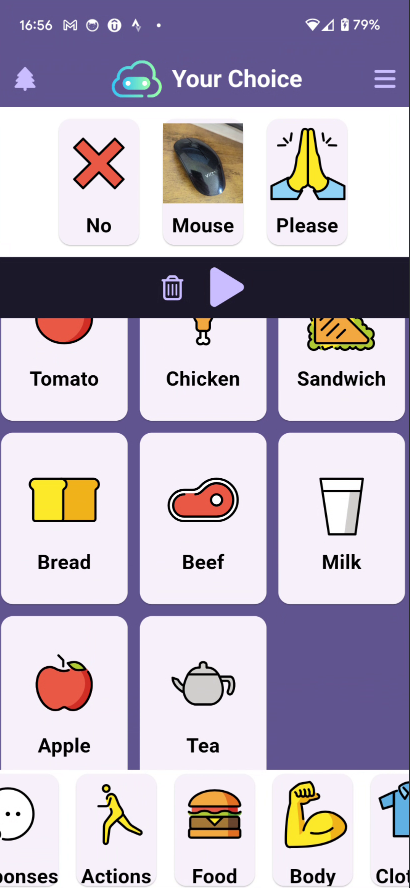
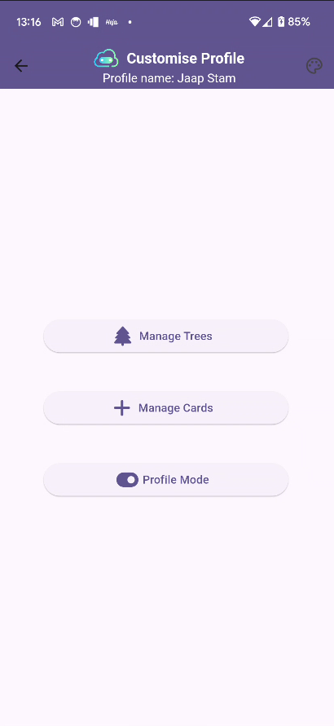
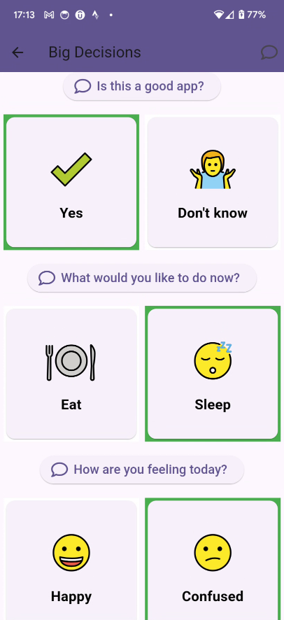
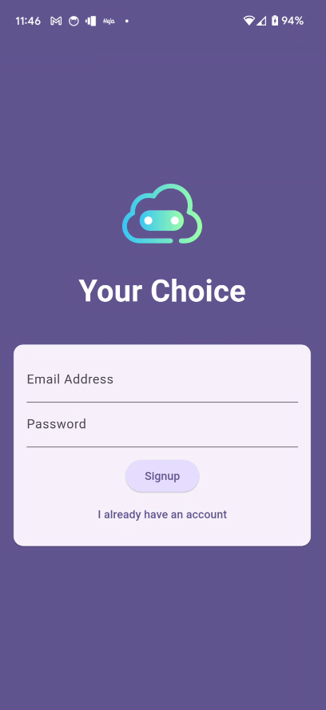

# your_choice

A new Flutter project.

## **1. Project Description**
your_choice is a customizable and user-friendly Augmentative and Alternative 
Communication (AAC) application designed to assist adults with cognitive impairments 
in making choices and communicating effectively. The app features a simple interface, 
customisable options including use of native camera and the ability to tailor
communication cards, and is adapted specifically to the needs of adults, 
including those recovering from stroke or living with dementia.

## **2. Table of Contents**

- [Project Description](#1-project-description)
- [Installation](#3-installation)
- [Usage](#4-usage)
- [App Manual](#5-app-manual)
- [Contributing](#6-contributing)
- [License](#7-license)
- [Acknowledgments](#8-acknowledgments)

## **3. Installation**

### **Prerequisites**
- **Flutter SDK**: Ensure you have the Flutter SDK installed on your machine.
- **Dart**: Make sure Dart is installed (comes with Flutter).
- **Firebase Setup**: Follow the instructions to set up Firebase.

### **Installation Steps**
1. **Clone the repository**:
   ```bash
    git clone https://github.com/jimmurf5/yourChoice2.git

2. **Navigate into the project directory**:
   ```bash
    cd your_project

3. **Install dependencies**:
   ```bash
    flutter pub get

4. **Run the application**:
   ```bash
    flutter run

## **4. Usage**

### Running the App
- To run the app on an emulator or physical device, use the following command:

  ```bash
  flutter run

**Basic Overview**

Communication Hub (CommHub): The central hub where users can see all communication cards and navigate through the app.





Customization Options: Customize your profile and communication cards to better fit the user's needs.





Display Tree: Visual representation of decision trees that guide the user through communication options.


.


Sign Up: Initial sign-up screen where users create an account to access personalized features.





For detailed **step-by-step** instructions on how to use each feature, 
including screenshots of each page, please refer to the [App Manual](documentation/yourChoiceAppManual.pdf).

## **5. App Manual**

For detailed instructions on how to use the app, 
please refer to the [App Manual](documentation/yourChoiceAppManual.pdf).

## **6. Contributing**

I welcome contributions from the community! If you'd like to contribute, please follow these guidelines:

### **Contribution Scope**
- We are looking for contributions in the form of bug fixes, new features, improvements to existing features, and enhancements to the documentation.

### **Reporting Issues**
- If you encounter any bugs or have suggestions for improvements, please open an issue in the repository.

### **Forking and Cloning the Repository**
1. **Fork the repository**: Click on the "Fork" button at the top right of the GitHub page.
2. **Clone the forked repository**:
   ```bash
   git clone https://github.com/your-username/your-choice.git

## **7. License**

This project is licensed under the MIT License - see the [LICENSE](LICENSE) file for details.

## **8. Acknowledgments**

- **Inspiration**: This project was inspired by existing AAC tools and the need for improved accessibility for adults with cognitive impairments.
- **Libraries/Tools**:
    - **`flutter_riverpod`**: Used for state management across the application.
    - **`firebase_core`, `firebase_auth`, `cloud_firestore`, `firebase_storage`**: Integrated for backend services including authentication, data storage, and file uploads.
    - **`hive` and `hive_flutter`**: Utilized for local data storage and caching.
    - **`flutter_tts`**: Implemented for text-to-speech functionality to enhance accessibility.
    - **`image_picker`**: Used for capturing and selecting images through the native device camera.
    - **`flutter_colorpicker`**: Included for enabling color customization options in the app.
    - **`http`**: Used for making network requests within the application.
    - **`uuid`**: Employed to generate unique identifiers for various elements within the app.
    - **`flutter_svg`**: Used to render SVG images in the app.
    - **`font_awesome_flutter`**: Integrated for additional iconography options.
    - **`state_notifier`**: Utilized to manage and notify state changes effectively.
    - **`path_provider`**: Used to find commonly used locations on the filesystem.
    - **`cupertino_icons`**: Included for iOS style icons.
    - **OpenMoji**: Icons sourced from OpenMoji, licensed under CC BY-SA 4.0 for use in the app.

- **Mentors**: Special thanks to [Moira Watson] for providing guidance and feedback throughout the project.
- **Testers**: I appreciate the feedback from [Matthew McGrath] and [Adam Murphy], who tested the app and provided valuable insights for improvements.